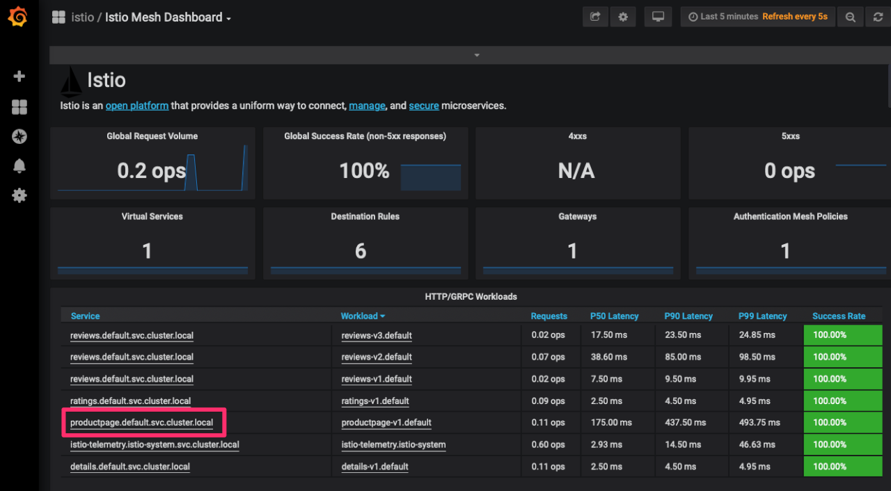

---
author:
  name: Linode
  email: docs@linode.com
description: 'Istio is a service mesh and a platform with its own API and feature set that can help you run a distributed microservice architecture. Istio is a tool that you can deploy with few to no code changes to your application allowing you to harness its power without disrupting your development cycle. In conjunction with Kubernetes, Istio provides you with insights into your cluster leading to more control over your applications.'
keywords: ['kuberenetes','istio','container','helm', 'k8s']
license: '[CC BY-ND 4.0](https://creativecommons.org/licenses/by-nd/4.0)'
published: 2019-11-05
modified_by:
  name: Linode
title: "How to Deploy Istio with Kubernetes"
h1_title: "Deploying Istio with Kubernetes"
contributor:
  name: Linode
external_resources:
- '[Istio](https://istio.io)'
- '[Istio Mesh Security](https://istio.io/docs/ops/security/)'
- '[Istio Troubleshooting](https://istio.io/docs/ops/troubleshooting/)'
---

[Istio](https://istio.io) is a service mesh, or a network of microservices, that can handle tasks such as load balancing, service-to-service authentication, monitoring, etc. It does this by deploying sidecar proxies to intercept network data, which causes little disruption to your current application.

Istio is also a platform with its own API and feature set that can help you run a distributed microservice architecture. Istio is a tool that you can deploy with few to no code changes to your applications allowing you to harness its power without disrupting your development cycle. In conjunction with Kubernetes, Istio provides you with insights into your cluster leading to more control over your applications.

In this guide:

- Setup a [Kubernetes Cluster](#setup-your-kubernetes-cluster), [Helm, and Tiller](#install-helm-and-tiller)
- [Install Istio with Helm Charts](#install-helm-charts)
- [Setup Envoy Proxies](#set-up-envoy-proxies)
- [Install the Istio Bookinfo App](#install-the-istio-bookinfo-app)
- [Visualize data with Istio's Grafana addon](#visualizations-with-grafana)


This guide’s example instructions will create several billable resources on your Linode account. If you do not want to keep using the example cluster that you create, be sure to delete it when you have finished the guide.

If you remove the resources afterward, you will only be billed for the hour(s) that the resources were present on your account. Consult the [Billing and Payments](https://www.linode.com/docs/platform/billing-and-support/billing-and-payments/)  guide for detailed information about how hourly billing works and for a table of plan pricing.


## Before You Begin

Familiarize yourself with Kubernetes with our series [A Beginner's Guide to Kubernetes](/docs/applications/containers/kubernetes/beginners-guide-to-kubernetes/) and [Advantaged of Using Kubernetes](/docs/applications/containers/kubernetes/kubernetes-use-cases/).

## Setup Your Kubernetes Cluster

There are many ways to setup a Kubernetes cluster. This guide will use the Linode k8s-alpha CLI. To set it up, see the
[How to Deploy Kubernetes on Linode with the k8s-alpha CLI](https://www.linode.com/docs/applications/containers/kubernetes/how-to-deploy-kubernetes-on-linode-with-k8s-alpha-cli/) and follow the steps up until the Create a Cluster section.

1.  For this guide you will need 3 worker nodes and one master. Now that you have the Linode k8s-alpha CLI ready you can easily deploy a cluster using the following command:

        linode-cli k8s-alpha create istio-cluster --node-type g6-standard-2 --nodes 3 --master-type g6-standard-2 --region us-east --ssh-public-key $HOME/.ssh/id_rsa.pub

1.  After the cluster is created you should see output that ends similar to this:

    
Apply complete! Resources: 5 added, 0 changed, 0 destroyed.
Switched to context "istio-cluster-ka4OLOcgqHw@istio-cluster".
Your cluster has been created and your kubectl context updated.

Try the following command:
kubectl get pods --all-namespaces

Come hang out with us in #linode on the Kubernetes Slack! http://slack.k8s.io/


1.  If you visit the [Linode Cloud Manager](https://cloud.linode.com/), you will see your newly created cluster nodes on the Linodes page.

### Install Helm and Tiller

Follow the instructions in [How to Install Apps on Kubernetes with Helm](https://www.linode.com/docs/applications/containers/kubernetes/how-to-install-apps-on-kubernetes-with-helm/) to install Helm and Tiller to your cluster. Stop before the section on Using Helm Charts to Install Apps.

## Install Istio

For Linux or macOS users, use curl to pull the Istio project files. You will want to do this even though you will use Helm charts to deploy Istio to our cluster because you want to get the sample `Bookinfo` application that comes with bundled with this installation.

    curl -L https://git.io/getLatestIstio | ISTIO_VERSION=1.3.3 sh -

If you are using Windows, you will need to go to Istio's [Github repo](https://github.com/istio/istio/releases) to find the download. Here you will find the latest releases for Windows, Linux, and macOS.


This will create a new directory `istio-1.3.3` wherever you use this command. Therefore, if you don't want this directory to be in your home directory, first move to the directory where you want it to be and then use the command.


### Install Helm Charts

1.  Add the Istio Helm repo:

        helm repo add istio.io https://storage.googleapis.com/istio-release/releases/1.3.2/charts/

1.  Update the helm repo listing:

        helm repo update

1.  Check that you have the repo with the following command:

        helm repo list | grep istio.io

1.  The output should be similar to the following:

    
istio.io	https://storage.googleapis.com/istio-release/releases/1.3.2/charts/


1.  Install Istio's [Custom Resource Definitions](https://kubernetes.io/docs/concepts/extend-kubernetes/api-extension/custom-resources/#customresourcedefinitions) with the helm chart:

        helm install --name istio-init --namespace istio-system istio.io/istio-init

    This also creates a pod namespace called `istio-system` which you will continue to use for the remainder of this guide.

     
NAME:   istio-init
LAST DEPLOYED: Fri Oct 18 10:24:24 2019
NAMESPACE: istio-system
STATUS: DEPLOYED

RESOURCES:
==> v1/ClusterRole
NAME                     AGE
istio-init-istio-system  0s

==> v1/ClusterRoleBinding
NAME                                        AGE
istio-init-admin-role-binding-istio-system  0s

==> v1/ConfigMap
NAME          DATA  AGE
istio-crd-10  1     0s
istio-crd-11  1     0s
istio-crd-12  1     0s

==> v1/Job
NAME                     COMPLETIONS  DURATION  AGE
istio-init-crd-10-1.3.2  0/1          0s        0s
istio-init-crd-11-1.3.2  0/1          0s        0s
istio-init-crd-12-1.3.2  0/1          0s        0s

==> v1/Pod(related)
NAME                           READY  STATUS             RESTARTS  AGE
istio-init-crd-10-1.3.2-d4gdf  0/1    ContainerCreating  0         0s
istio-init-crd-11-1.3.2-h8l58  0/1    ContainerCreating  0         0s
istio-init-crd-12-1.3.2-v9777  0/1    ContainerCreating  0         0s

==> v1/ServiceAccount
NAME                        SECRETS  AGE
istio-init-service-account  1        0s


1.  Verify that all CRDs were successfully installed by running the following command:

        kubectl get crds | grep 'istio.io' | wc -l

1.  You should see the following output:

    
23


       If the number is less, you may need to wait a few moments for the resources to finish being created.

1.  Install the Helm chart for Istio. There are [many installation options available](https://istio.io/docs/reference/config/installation-options/) for Istio. For this guide you are setting the Grafana option to use the visualization later.

        helm install --name istio --namespace istio-system istio.io/istio --set grafana.enabled=true

     

NAME:   istio
LAST DEPLOYED: Fri Oct 18 10:28:40 2019
NAMESPACE: istio-system
STATUS: DEPLOYED

RESOURCES:
==> v1/ClusterRole
NAME                                     AGE
istio-citadel-istio-system               43s
istio-galley-istio-system                43s
istio-grafana-post-install-istio-system  43s
istio-mixer-istio-system                 43s
istio-pilot-istio-system                 43s
istio-reader                             43s
istio-sidecar-injector-istio-system      43s
prometheus-istio-system                  43s

==> v1/ClusterRoleBinding
NAME                                                    AGE
istio-citadel-istio-system                              43s
istio-galley-admin-role-binding-istio-system            43s
istio-grafana-post-install-role-binding-istio-system    43s
istio-mixer-admin-role-binding-istio-system             43s
istio-multi                                             43s
istio-pilot-istio-system                                43s
istio-sidecar-injector-admin-role-binding-istio-system  43s
prometheus-istio-system                                 43s

==> v1/ConfigMap
NAME                                                                DATA  AGE
istio                                                               2     43s
istio-galley-configuration                                          1     44s
istio-grafana                                                       2     43s
istio-grafana-configuration-dashboards-citadel-dashboard            1     44s
istio-grafana-configuration-dashboards-galley-dashboard             1     43s
istio-grafana-configuration-dashboards-istio-mesh-dashboard         1     44s
istio-grafana-configuration-dashboards-istio-performance-dashboard  1     43s
istio-grafana-configuration-dashboards-istio-service-dashboard      1     44s
istio-grafana-configuration-dashboards-istio-workload-dashboard     1     44s
istio-grafana-configuration-dashboards-mixer-dashboard              1     44s
istio-grafana-configuration-dashboards-pilot-dashboard              1     44s
istio-grafana-custom-resources                                      2     44s
istio-security-custom-resources                                     2     43s
istio-sidecar-injector                                              2     43s
prometheus                                                          1     43s

==> v1/Deployment
NAME                    READY  UP-TO-DATE  AVAILABLE  AGE
grafana                 0/1    1           0          42s
istio-citadel           1/1    1           1          42s
istio-galley            0/1    1           0          42s
istio-ingressgateway    0/1    1           0          42s
istio-pilot             0/1    1           0          42s
istio-policy            0/1    1           0          42s
istio-sidecar-injector  0/1    1           0          42s
istio-telemetry         1/1    1           1          42s
prometheus              0/1    1           0          42s

==> v1/Pod(related)
NAME                                     READY  STATUS             RESTARTS  AGE
grafana-575c7c4784-ffq79                 0/1    ContainerCreating  0         42s
istio-citadel-746b4cc66c-2zq2d           1/1    Running            0         42s
istio-galley-668765c7dc-r7w49            0/1    ContainerCreating  0         42s
istio-ingressgateway-76ff5cf54b-n5xzl    0/1    Running            0         42s
istio-pilot-7b6f4b4498-pfcm5             0/2    ContainerCreating  0         42s
istio-policy-8449665784-xzn7m            0/2    ContainerCreating  0         42s
istio-sidecar-injector-7488c45bcb-mzfgz  0/1    Running            0         42s
istio-telemetry-56595ccd89-qxtb7         2/2    Running            1         42s
prometheus-5679cb4dcd-8fsf4              0/1    ContainerCreating  0         42s

==> v1/Role
NAME                      AGE
istio-ingressgateway-sds  43s

==> v1/RoleBinding
NAME                      AGE
istio-ingressgateway-sds  43s

==> v1/Service
NAME                    TYPE          CLUSTER-IP      EXTERNAL-IP      PORT(S)                                                                                                                                     AGE
grafana                 ClusterIP     10.111.223.85   <none>           3000/TCP                                                                                                                                    43s
istio-citadel           ClusterIP     10.96.57.68     <none>           8060/TCP,15014/TCP                                                                                                                          42s
istio-galley            ClusterIP     10.111.114.219  <none>           443/TCP,15014/TCP,9901/TCP                                                                                                                  43s
istio-ingressgateway    LoadBalancer  10.104.28.12    104.237.148.149  15020:31189/TCP,80:31380/TCP,443:31390/TCP,31400:31400/TCP,15029:30450/TCP,15030:32554/TCP,15031:30659/TCP,15032:32716/TCP,15443:32438/TCP  43s
istio-pilot             ClusterIP     10.97.46.215    <none>           15010/TCP,15011/TCP,8080/TCP,15014/TCP                                                                                                      42s
istio-policy            ClusterIP     10.104.45.158   <none>           9091/TCP,15004/TCP,15014/TCP                                                                                                                42s
istio-sidecar-injector  ClusterIP     10.110.88.188   <none>           443/TCP,15014/TCP                                                                                                                           42s
istio-telemetry         ClusterIP     10.103.18.40    <none>           9091/TCP,15004/TCP,15014/TCP,42422/TCP                                                                                                      42s
prometheus              ClusterIP     10.105.19.61    <none>           9090/TCP                                                                                                                                    42s

==> v1/ServiceAccount
NAME                                    SECRETS  AGE
istio-citadel-service-account           1        43s
istio-galley-service-account            1        43s
istio-grafana-post-install-account      1        43s
istio-ingressgateway-service-account    1        43s
istio-mixer-service-account             1        43s
istio-multi                             1        43s
istio-pilot-service-account             1        43s
istio-security-post-install-account     1        43s
istio-sidecar-injector-service-account  1        43s
prometheus                              1        43s

==> v1alpha2/attributemanifest
NAME        AGE
istioproxy  41s
kubernetes  41s

==> v1alpha2/handler
NAME           AGE
kubernetesenv  41s
prometheus     41s

==> v1alpha2/instance
NAME                  AGE
attributes            41s
requestcount          41s
requestduration       41s
requestsize           41s
responsesize          41s
tcpbytereceived       41s
tcpbytesent           41s
tcpconnectionsclosed  41s
tcpconnectionsopened  41s

==> v1alpha2/rule
NAME                     AGE
kubeattrgenrulerule      41s
promhttp                 41s
promtcp                  41s
promtcpconnectionclosed  41s
promtcpconnectionopen    41s
tcpkubeattrgenrulerule   41s

==> v1alpha3/DestinationRule
NAME             AGE
istio-policy     42s
istio-telemetry  42s

==> v1beta1/ClusterRole
NAME                                      AGE
istio-security-post-install-istio-system  43s

==> v1beta1/ClusterRoleBinding
NAME                                                   AGE
istio-security-post-install-role-binding-istio-system  43s

==> v1beta1/MutatingWebhookConfiguration
NAME                    AGE
istio-sidecar-injector  41s

==> v1beta1/PodDisruptionBudget
NAME                    MIN AVAILABLE  MAX UNAVAILABLE  ALLOWED DISRUPTIONS  AGE
istio-galley            1              N/A              0                    44s
istio-ingressgateway    1              N/A              0                    44s
istio-pilot             1              N/A              0                    44s
istio-policy            1              N/A              0                    44s
istio-sidecar-injector  1              N/A              0                    44s
istio-telemetry         1              N/A              0                    44s

==> v2beta1/HorizontalPodAutoscaler
NAME                  REFERENCE                        TARGETS        MINPODS  MAXPODS  REPLICAS  AGE
istio-ingressgateway  Deployment/istio-ingressgateway  <unknown>/80%  1        5        1         42s
istio-pilot           Deployment/istio-pilot           <unknown>/80%  1        5        1         41s
istio-policy          Deployment/istio-policy          <unknown>/80%  1        5        1         42s
istio-telemetry       Deployment/istio-telemetry       <unknown>/80%  1        5        1         42s

NOTES:
Thank you for installing Istio.

Your release is named Istio.

To get started running application with Istio, execute the following steps:
1. Label namespace that application object will be deployed to by the following command (take default namespace as an example)

$ kubectl label namespace default istio-injection=enabled
$ kubectl get namespace -L istio-injection

2. Deploy your applications

$ kubectl apply -f <your-application>.yaml

For more information on running Istio, visit:
https://istio.io/




1.  Verify that the Istio services and Grafana are running with this command:

        kubectl get svc -n istio-system

1.  The output should be similar to this:

    
NAME                     TYPE           CLUSTER-IP       EXTERNAL-IP    PORT(S)                                                                                                                                      AGE
grafana                  ClusterIP      10.111.81.20     <none>         3000/TCP                                                                                                                                     4m6s
istio-citadel            ClusterIP      10.100.103.171   <none>         8060/TCP,15014/TCP                                                                                                                           4m6s
istio-galley             ClusterIP      10.104.173.105   <none>         443/TCP,15014/TCP,9901/TCP                                                                                                                   4m7s
istio-ingressgateway     LoadBalancer   10.97.218.128    23.92.23.198   15020:30376/TCP,80:31380/TCP,443:31390/TCP,31400:31400/TCP,15029:31358/TCP,15030:30826/TCP,15031:30535/TCP,15032:31728/TCP,15443:31970/TCP   4m6s
istio-pilot              ClusterIP      10.108.36.63     <none>         15010/TCP,15011/TCP,8080/TCP,15014/TCP                                                                                                       4m6s
istio-policy             ClusterIP      10.111.111.45    <none>         9091/TCP,15004/TCP,15014/TCP                                                                                                                 4m6s
istio-sidecar-injector   ClusterIP      10.96.23.143     <none>         443/TCP,15014/TCP                                                                                                                            4m5s
istio-telemetry          ClusterIP      10.103.224.18    <none>         9091/TCP,15004/TCP,15014/TCP,42422/TCP                                                                                                       4m6s
prometheus               ClusterIP      10.96.246.56     <none>         9090/TCP                                                                                                                                     4m6s


1.  You can also see the pods running by using this command:

        kubectl get pods -n istio-system

1.  The output will look similar to this:

    
NAME                                      READY   STATUS      RESTARTS   AGE
grafana-575c7c4784-v2vj2                  1/1     Running     0          4m54s
istio-citadel-746b4cc66c-jnjx9            1/1     Running     0          4m53s
istio-galley-668765c7dc-vt88j             1/1     Running     0          4m54s
istio-ingressgateway-76ff5cf54b-dmksf     1/1     Running     0          4m54s
istio-init-crd-10-1.3.2-t4sqg             0/1     Completed   0          11m
istio-init-crd-11-1.3.2-glr72             0/1     Completed   0          11m
istio-init-crd-12-1.3.2-82gn4             0/1     Completed   0          11m
istio-pilot-7b6f4b4498-vtb8s              2/2     Running     0          4m53s
istio-policy-8449665784-8hjsw             2/2     Running     4          4m54s
istio-sidecar-injector-7488c45bcb-b4qz4   1/1     Running     0          4m53s
istio-telemetry-56595ccd89-jcc9s          2/2     Running     5          4m54s
prometheus-5679cb4dcd-pbg6m               1/1     Running     0          4m53s


1.  Before moving on, be sure that all pods are in the `Running` or `Completed` status.


If you need to troubleshoot, you can check a specific pod by using `kubectl`, remembering that you set the namespace to `istio-system`:

    kubectl describe pods pod_name -n pod_namespace

And check the logs by using:

    kubectl logs pod_name -n pod_namespace

### Set up Envoy Proxies

1.  Istio's service mesh runs by employing *sidecar proxies*. You will enable them by injecting them into the containers with the following command:

        kubectl label namespace default istio-injection=enabled

    Notice that this command is using the `default` namespace which is where you will be deploying the `Bookinfo` application.

    
This deployment uses automatic sidecar injection. Automatic injection can be disabled and [manual injection](https://istio.io/docs/setup/additional-setup/sidecar-injection/#manual-sidecar-injection) enabled during installation via `istioctl`. If you disabled automatic injection during installation, use the following command to modify the `bookinfo.yaml` file before deploying the application:

    kubectl apply -f <(istioctl kube-inject -f samples/bookinfo/platform/kube/bookinfo.yaml)


1.  Verify that it applied the `enabled` label to the `default` namespace with the following command:

        kubectl get namespace -L istio-injection

1.  You will get similar output:

    
NAME           STATUS   AGE    ISTIO-INJECTION
default        Active   101m   enabled
istio-system   Active   37m
kube-public    Active   101m
kube-system    Active   101m


## Install the Istio Bookinfo App

The Bookinfo app is a sample application that comes packaged with Istio. It features four microservices in four different languages that are all separate from Istio itself. The application is a simple single page website that displays a "book store" catalog page with one book, it's details, and some reviews. The microservices are:

- `productpage` is written in Python and calls `details` and `reviews` to populate the page.
- `details` is written in Ruby and contains the book information.
- `reviews` is written in Java and contains book reviews and calls `ratings`.
- `ratings` is written in Node.js and contains book ratings. There are three versions of this microservice in the application. A different version is called each time the page is refreshed.

1.  Navigate to the directory where you [installed Istio](#install-istio).

1.  The `bookinfo.yaml` file is the application manifest. It specifies all the service and deployment objects for the application. Here is just the `productpage` section of this file, feel free to look at the entire file:

    
...

apiVersion: v1
kind: Service
metadata:
  name: productpage
  labels:
    app: productpage
    service: productpage
spec:
  ports:
  - port: 9080
    name: http
  selector:
    app: productpage
---
apiVersion: v1
kind: ServiceAccount
metadata:
  name: bookinfo-productpage
---
apiVersion: apps/v1
kind: Deployment
metadata:
  name: productpage-v1
  labels:
    app: productpage
    version: v1
spec:
  replicas: 1
  selector:
    matchLabels:
      app: productpage
      version: v1
  template:
    metadata:
      labels:
        app: productpage
        version: v1
    spec:
      serviceAccountName: bookinfo-productpage
      containers:
      - name: productpage
        image: docker.io/istio/examples-bookinfo-productpage-v1:1.15.0
        imagePullPolicy: IfNotPresent
        ports:
        - containerPort: 9080
---


1.  Start the `Bookinginfo` application with the following command:

        kubectl apply -f samples/bookinfo/platform/kube/bookinfo.yaml

1.  The following output results:

    
service/details created
serviceaccount/bookinfo-details created
deployment.apps/details-v1 created
service/ratings created
serviceaccount/bookinfo-ratings created
deployment.apps/ratings-v1 created
service/reviews created
serviceaccount/bookinfo-reviews created
deployment.apps/reviews-v1 created
jdeployment.apps/reviews-v2 created
deployment.apps/reviews-v3 created
service/productpage created
serviceaccount/bookinfo-productpage created
deployment.apps/productpage-v1 created


1.  Check that all the services are up and running:

        kubectl get services

1.  The output will look similar to the following:

    
    NAME          TYPE        CLUSTER-IP      EXTERNAL-IP   PORT(S)    AGE
details       ClusterIP   10.97.188.175   <none>        9080/TCP   3m
kubernetes    ClusterIP   10.96.0.1       <none>        443/TCP    154m
productpage   ClusterIP   10.110.184.42   <none>        9080/TCP   2m37s
ratings       ClusterIP   10.102.206.99   <none>        9080/TCP   2m59s
reviews       ClusterIP   10.106.21.117   <none>        9080/TCP   2m59s


1.  Check that the pods are all up:

        kubectl get pods

1.  The expected output should look similar, with all pods running:

    
NAME                              READY   STATUS    RESTARTS   AGE
details-v1-68fbb76fc-qfpbd        2/2     Running   0          4m48s
productpage-v1-6c6c87ffff-th52x   2/2     Running   0          4m15s
ratings-v1-7bdfd65ccc-z8grs       2/2     Running   0          4m48s
reviews-v1-5c5b7b9f8d-6xljj       2/2     Running   0          4m41s
reviews-v2-569796655b-x2n4v       2/2     Running   0          4m30s
reviews-v3-844bc59d88-pwl6b       2/2     Running   0          4m30s


    
If you do not see all pods running right away, you may need to wait a few moments for them to complete the initialization process.


1.  Check that the `Bookinfo` application is running by issuing the following command which will pull the title tag and contents from the `/productpage` from the `ratings` pod:

        kubectl exec -it $(kubectl get pod -l app=ratings -o jsonpath='{.items[0].metadata.name}') -c ratings -- curl productpage:9080/productpage | grep -o "<title>.*</title>"

1.  The expected output will look like this:

    
&lt;title&gt;Simple Bookstore App&lt;/title&gt;


### Open the Istio Gateway

1.  If you noticed above when checking the services, none had external IPs. This is because Kubernetes services are private by default, you will need to open a gateway in order to access the app from the web browser. To do this you will use an Istio Gateway.

    Here are the contents of the `bookinfo-gateway.yaml` file.

    
apiVersion: networking.istio.io/v1alpha3
kind: Gateway
metadata:
  name: bookinfo-gateway
spec:
  selector:
    istio: ingressgateway # use istio default controller
  servers:
  - port:
      number: 80
      name: http
      protocol: HTTP
    hosts:
    - "*"
---
apiVersion: networking.istio.io/v1alpha3
kind: VirtualService
metadata:
  name: bookinfo
spec:
  hosts:
  - "*"
  gateways:
  - bookinfo-gateway
  http:
  - match:
    - uri:
        exact: /productpage
    - uri:
        prefix: /static
    - uri:
        exact: /login
    - uri:
        exact: /logout
    - uri:
        prefix: /api/v1/products
    route:
    - destination:
        host: productpage
        port:
          number: 9080


  - In the `Gateway` section you are setting `server` and specifying the `port` and `protocol` that will be opened through the gateway. Note that the `name` must match Istio's [named service ports standardization scheme](https://istio.io/docs/setup/additional-setup/requirements/).
  - In the `Virtual Service` section, the `http` field defines how HTTP traffic will be routed, and the `destination` field says where requests are routed.

1.  Apply the ingress gateway with the following command:

        kubectl apply -f samples/bookinfo/networking/bookinfo-gateway.yaml

1.  You should see the following output:

    
gateway.networking.istio.io/bookinfo-gateway created
virtualservice.networking.istio.io/bookinfo created


1.  Confirm the gateway is open:

        kubectl get gateway

1.  The output:

    
NAME               AGE
bookinfo-gateway   1m


1.  Determine if your Kubernetes cluster supports external load balancers:

        kubectl get svc istio-ingressgateway -n istio-system

1.  The output should look similar to this:

    
NAME                   TYPE           CLUSTER-IP      EXTERNAL-IP    PORT(S)                                                                                                                                      AGE
istio-ingressgateway   LoadBalancer   10.97.218.128   23.92.23.198   15020:30376/TCP,80:31380/TCP,443:31390/TCP,31400:31400/TCP,15029:31358/TCP,15030:30826/TCP,15031:30535/TCP,15032:31728/TCP,15443:31970/TCP   21h


    If `EXTERNAL-IP` has a value, then your cluster supports external load balancers and you can [open a gateway using that method](#open-a-gateway-with-the-external-load-balancer), if it's value is `<none>` or stays in `<pending>` then your environment does not provide an external load balancer for the ingress gateway. If this is the case, you will need to [open a gateway using the node port](#open-a-gateway-with-the-node-port).

### Apply Default Destination Rules

1.  Destination rules specify named service subsets and give them routing rules to control traffic to the different instances of your services. Apply the destination rules with the following command:

        kubectl apply -f samples/bookinfo/networking/destination-rule-all.yaml

1.  The output will appear as follows:

    
destinationrule.networking.istio.io/productpage created
destinationrule.networking.istio.io/reviews created
destinationrule.networking.istio.io/ratings created
destinationrule.networking.istio.io/details created


1.  You can view all the rules with this command:

        kubectl get destinationrules -o yaml

## Visualizations with Grafana

1.  In a terminal window that you can leave open, run this command to open the port for Grafana:

        kubectl -n istio-system port-forward $(kubectl -n istio-system get pod -l app=grafana -o jsonpath='{.items[0].metadata.name}') 3000:3000 &

1. If you're not using your local matching as your control node, create a new SSH tunnel from your local machine to your Linode with the following command so that you can access the localhost of your Linode, entering your credentials as prompted:

        ssh -L 3000:localhost:3000 <username>@<ipaddress>

    Once this is completed, or if your control node is your local machine, visit the following site in your web browser:

        http://localhost:3000/dashboard/db/istio-mesh-dashboard

1.  You will see the *Mesh Dashboard*.

    

    Notice that there's no data available yet.

1.  Send data by visiting a product page, replacing `$GATEWAY_URL` with the value for yours:

        http://$GATEWAY_URL/productpage

    Refresh the page a few times to generate some traffic.

1.  Return to the dashboard and refresh the page to see the data.

    

    The *Mesh Dashboard* displays a general overview of Istio service mesh, the services that are running, and their workloads.

1.  To view a specific service or workload you can click on them from the *HTTP/GRPC Workloads* list. Under the *Service* column, click `productpage.default.svc.cluster.local` from the *HTTP/GRPC Workloads* list.

    

1.  This will open a Service dashboard specific to this service.

    

1.  Feel free to explore the other Grafana dashboards for more metrics and data. You can access all the dashboards from the dropdown menu at the top left of the screen.

## Removing Clusters and Deployments

If you at any time need to remove the resources created when following this guide, enter the following commands, confirming any prompts that appear:

    helm delete istio-init
    helm delete istio
    linode-cli k8s-alpha delete istio-cluster