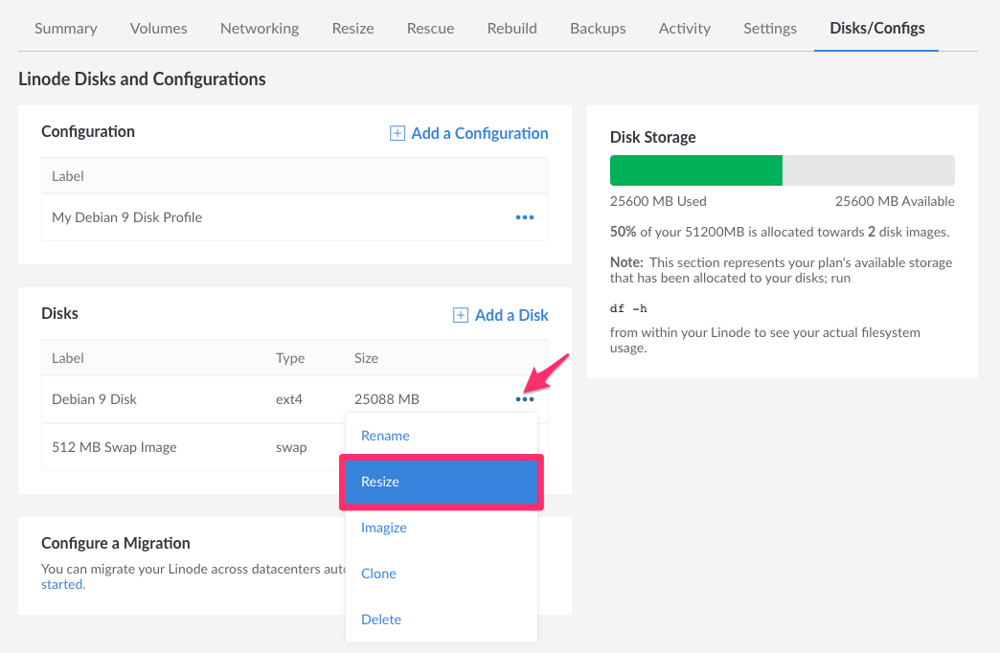
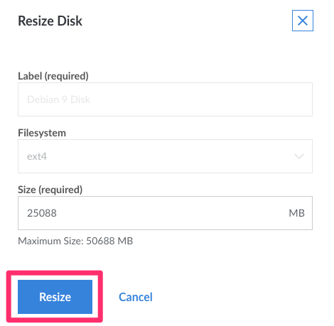

---
author:
  name: Linode
  email: docs@linode.com
description: Our guide to upgrading and resizing your Linode
keywords: ["upgrading", "resizing", "disk space"]
license: '[CC BY-ND 4.0](https://creativecommons.org/licenses/by-nd/4.0)'
aliases: ['migrate-to-linode/disk-images/resizing-a-linode/','platform/disk-images/resizing-a-linode-classic-manager/','resizing/']
modified: 2019-03-28
modified_by:
  name: Linode
published: 2017-02-14
title: Resizing a Linode
---

We make it easy to upgrade or downgrade your Linode by changing plans and adding additional resources. If you're expecting a temporary burst of traffic to your website, or if you're not using your Linode as much as you thought, you can temporarily or permanently resize your Linode to a different plan.


Linodes can be resized to a smaller or larger plan. A [Shared](https://www.linode.com/products/shared) plan can also be converted to a [High Memory](https://www.linode.com/pricing/) plan, or vice versa.


## Before You Begin

- To complete the resizing process, **your Linode is powered off** and migrated to a different host in the same data center.
- Your data, configuration profiles, and IP addresses need to be moved to the new host.
- The migration takes approximately 1 minute for every 3-5 gigabytes of data.

## Moving to a Smaller Plan

While sizing up to a larger plan can be automated, sizing down to a smaller plan requires some manual work before proceeding.

1.  Determine the disk size of the plan you are moving to. Plan specifications are on the [Pricing Page](https://www.linode.com/pricing/). Look specifically at the **Storage** column for sizes.

1.  Check to see how much space you are currently using on your disk. You can do this by running the following command:

        df -h

1.  Your next steps depend on the total of the *Used* column from the `df -h` command above.

      - If you're using less space than your intended plan requires, you can move onto the next step without any further action.
      - If you're using more space than your intended plan allows, you need to remove some files to free up some space before moving onto the next step. See the options for doing this in the [Download Files from Your Linode](/docs/security/data-portability/download-files-from-your-linode/) guide.

1.  Before resizing your Linode to a new plan, you need to [resize the disk](/docs/quick-answers/linode-platform/resize-a-linode-disk/) to match the storage volume of the new plan.

## Resizing Your Linode

Here's how to resize your Linode to a different plan:

1.  Log into the [Linode Manager](https://cloud.linode.com).
1.  Click the **Linodes** link in the sidebar.
1.  Select a Linode from the list.
1.  Click the **Resize** tab. The webpage shown below appears.

    

1.  If you're moving to a larger plan, you can automatically resize your primary disk by selecting the **Auto Resize Disk** checkbox.

    
Automatic resizing is only available when moving to a larger plan, and when you have a single ext disk (or one ext and one swap disk) on your Linode.
    

    

1.  Select a plan and click the **Submit** button. Your Linode is then powered off and moved to another host. Depending on the size of your Linode, this process can take up to one hour.

1.  (Optional) When the migration completes, check your disk storage allocation meter. If you resized your Linode to a larger plan and the main disk was not automatically resized, there is additional un-used storage to allocate to your disks. You may want to add some of this storage to one of your disks if the internal filesystem on it is running low on free space, or just so you can use it in the future.

    Navigate to your Linode's **Disks/Config** tab to view your disk storage allocation meter. Click on the **More Options Ellipses** link (...) next to the disk you'd like to allocate the extra storage to and select **Resize**.

    

    The *Resize Disk* panel appears. In the **Size** field, enter a new size in the specified range and click **Resize**.

    

1.  Once completed, your Linode is still powered off. Scroll to the top of the page and click on the **Offline** button and select **Power On**.

Your Linode has been successfully resized and migrated to the new host.
